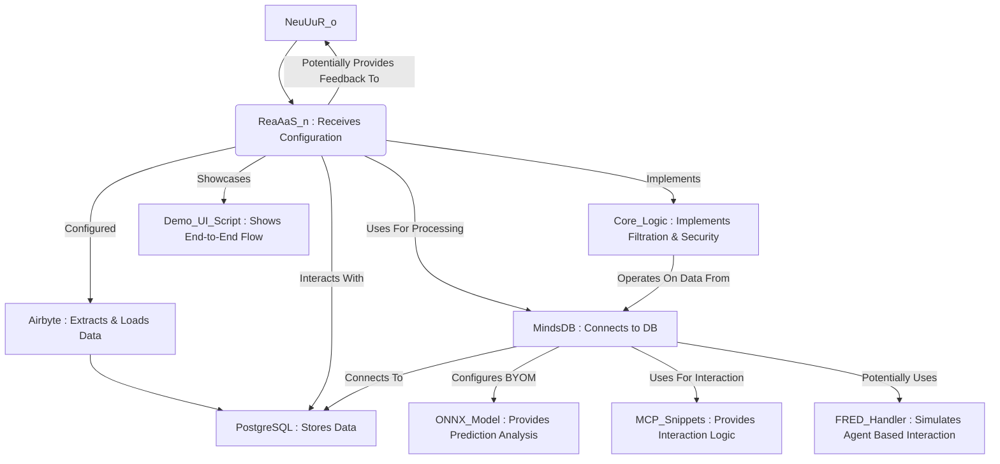

# ReaAaS-n System Architecture

This repository contains the system architecture for ReaAaS-n, a modular and configurable system designed to handle data ingestion, storage, processing, and presentation. The system is composed of several modules, each with a specific role and functionality.

## Mermaid Mind Map Chart

```mermaid
mindmap
  root((System Architecture for ReaAaS-n))
    NeuUuR_o
      Role: Configurator/Director
      SendsConfigurationTo() ReaAaS_n
    ReaAaS_n
      Role: Configured/Executor
      ReceivesConfigurationFrom() NeuUuR_o
      ExecutesActions()
      InteractsWithData()
      PerformsComputations()
      GeneratesOutput()
      PotentiallyProvidesFeedback() NeuUuR_o
      Uses Airbyte (Data Ingestion)
      Interacts With PostgreSQL (Data Storage)
      Uses MindsDB (AI Layer) for Processing
      Implements Core_Logic (Filtration/Security)
      Showcases with Demo_UI_Script (Presentation)
    Airbyte
      Role: Data Ingestion
      ExtractsData()
      LoadsData() PostgreSQL
    PostgreSQL
      Role: Data Storage
      StoresIngestedData()
      Connected to by MindsDB
    MindsDB
      Role: AI Layer for Database
      ConnectsToDatabase() PostgreSQL
      ConfiguresBYOM() ONNX_Model
      ProcessesData()
      CallsFREDHandler() (Potentially)
      Uses ONNX_Model (Machine Learning Model) via BYOM
      Uses MCP_Snippets (Model Component Protocol) for Interaction
      Operates On Data From Core_Logic
    ONNX_Model
      Role: Machine Learning Model
      DefinesInputOutputSchema()
      ProvidesPredictionAnalysis()
      Used by MindsDB via BYOM
    MCP_Snippets
      Role: Model Component Protocol
      ProvidesInteractionLogic()
      Used by MindsDB for Interaction
    Core_Logic
      Role: Filtration/Security Logic
      ImplementsFiltration()
      ImplementsSecurity()
      UsesFfeD_Quantum_Concepts()
      UsesAlgorithmBuilderApp()
      UsesVisualAlgorithmDesigner()
      Data operated on by MindsDB
    FRED_Handler
      Role: Custom Data Interaction
      SimulatesAgentBasedInteraction()
      Potentially Used by MindsDB
    Demo_UI_Script
      Role: Presentation
      ShowsEndToEndFlow()
      HighlightsProcessingStep()
      Showcased by ReaAaS_n
```

## Extensive Flowchart


